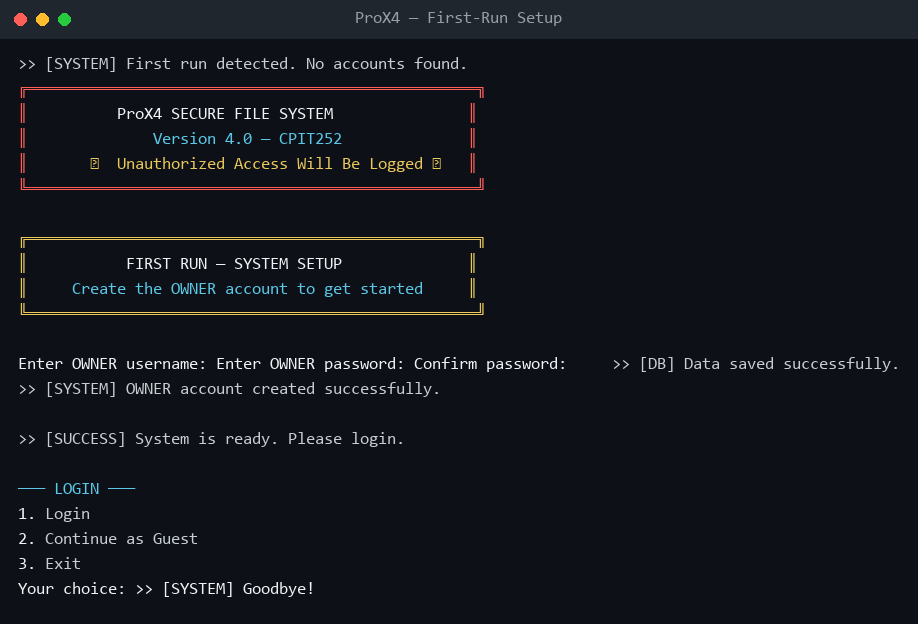
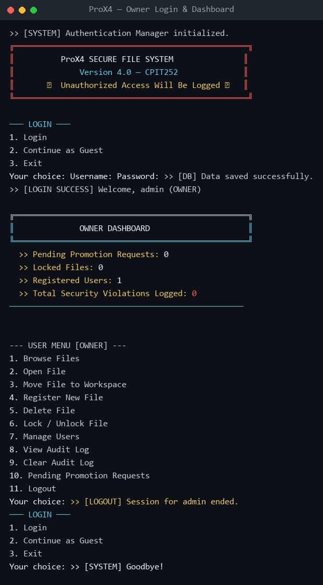
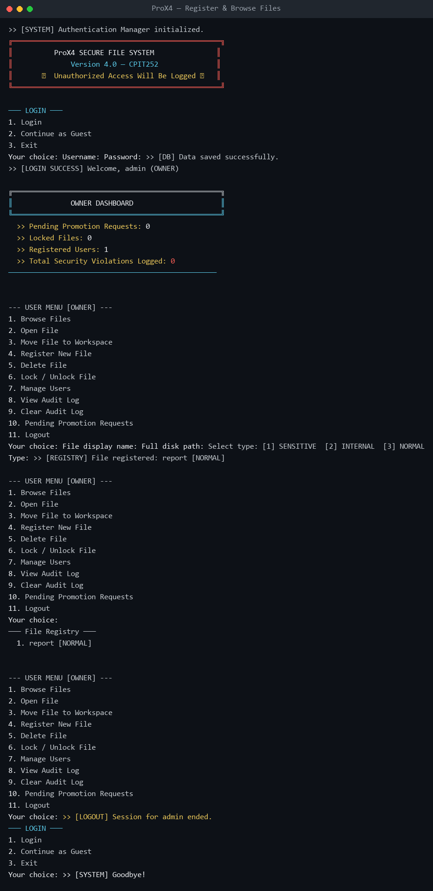
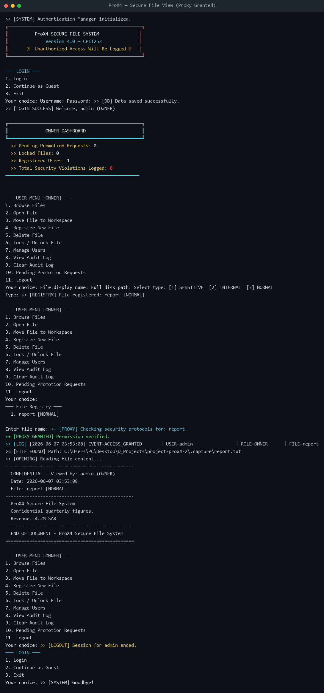
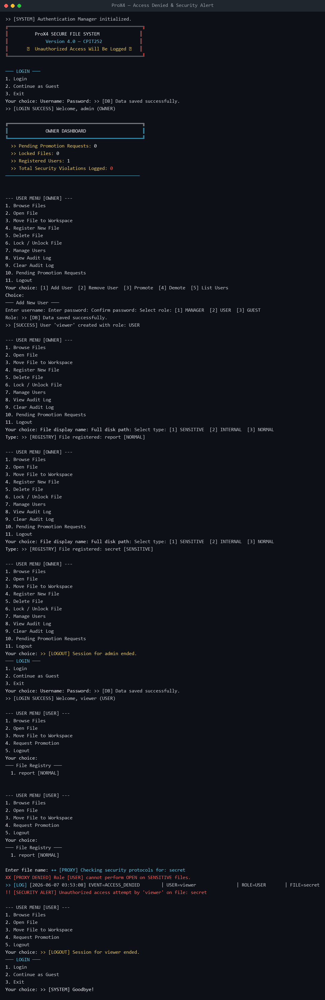

# ProX4 – Secure Access Proxy System

[](https://github.com/cpit252-spring-26-IT1/project-prox4-2/actions/workflows/ci.yml)

## Description

A Java CLI application that simulates a secure file-access system built around classic
design patterns to keep security logic cleanly separated from business logic. A **Proxy**
layer intercepts every file request to enforce role-based permissions, lock checks, view
limits and business-hours rules, while an **Observer** layer reacts to every security event
(console alerts + persistent audit log). User accounts are persisted in an **encrypted**
local database with hashed passwords and brute-force lockout.

**Team:** Nawaf Baryan (2338019) · Abdulrhman Nasiri (2337601)
**Course:** CPIT-252 · King Abdulaziz University, FCIT

### Design Patterns Used
- **Singleton** (Creational) — `AuthenticationManager`, `FileRegistry` and `PromotionManager`
  each expose a single shared instance.
- **Proxy** (Structural) — `SecureFileProxy` guards the real `RealFileAccess` resource;
  `DownloadProxy` guards file downloads.
- **Observer** (Behavioral) — `SecureFileProxy` notifies `SecurityLogger` and `AlertObserver`
  of every `AccessEvent`.

## Features
- **Role-Based Access Control** with four roles (`OWNER`, `MANAGER`, `USER`, `GUEST`) and
  three file sensitivity levels (`SENSITIVE`, `INTERNAL`, `NORMAL`).
- **Secure accounts** — passwords hashed with SHA-256, account auto-lockout after 3 failed
  attempts, and an AES-encrypted user database (`users.dat`).
- **First-run setup** — on first launch you create the `OWNER` account; there are no
  hard-coded credentials.
- **View-limit enforcement** — each non-owner is limited to 3 views per file.
- **File operations** — register, browse, open (with confidential watermark), move to a
  workspace, delete, and lock/unlock files.
- **User management** — owners add / remove / promote / demote users; managers may add users.
- **Promotion workflow** — users and guests can request a promotion; owners approve or reject.
- **Owner dashboard** — at-a-glance pending requests, locked files, registered users and
  logged security violations.
- **Auditing** — every event is written to `access_log.txt`; a built-in colored audit-log
  viewer lets owners review or clear it.
- **Real-time security alerts** for unauthorized access attempts and view-limit violations.

## Usage

### Build & run (Maven)
```shell
mvn clean package
java -jar target/course-project.jar
```

> On Windows, run with UTF-8 so the boxes/colors render correctly:
> `java -Dstdout.encoding=UTF-8 -jar target/course-project.jar`

### Run with Docker
```shell
docker build -t prox4:latest .
docker run -it --rm prox4:latest
```
To persist accounts and logs between runs, mount a volume:
```shell
docker run -it --rm -v "${PWD}/data:/app" prox4:latest
```

### First run & roles
On first launch the app detects an empty database and asks you to create the **OWNER**
account. After that, log in (or continue as a **Guest**). Capabilities by role:

| Role | Can see | Highlights |
|---|---|---|
| **OWNER** | all files | full control; bypasses lock/view-limit; user management; dashboard; audit log |
| **MANAGER** | SENSITIVE, INTERNAL, NORMAL | open/move/lock; delete NORMAL; add USER accounts |
| **USER** | INTERNAL, NORMAL | open/move; request promotion |
| **GUEST** | NORMAL only | browse; request promotion |

## Testing & Coverage

Unit + integration tests run with JUnit 5; coverage is measured by JaCoCo. The single
`AppTest` suite combines pure unit tests with full integration runs of `App.main` (driven
through a redirected `System.in`) so that even the interactive menu flows are exercised.

```shell
mvn test
```
- **51 tests**, all passing.
- **97.3% line coverage** (919 / 944 lines).
- **91% branch coverage** (408 / 447 branches).
- HTML report generated at `target/site/jacoco/index.html`.

The handful of uncovered lines are unreachable defensive `catch` blocks (e.g. SHA-256
unavailable, AES failure with a valid key, I/O write failures) and guarded dead branches.

## Project Highlights / What's Included
- ✅ Clean separation of concerns via **Singleton + Proxy + Observer** patterns.
- ✅ **Encrypted, persistent** account store with hashed passwords and lockout.
- ✅ **97.3%** test line coverage with JUnit 5 + JaCoCo (`AppTest`).
- ✅ **Dockerized** with a multi-stage build (`Dockerfile` + `.dockerignore`).
- ✅ Executable JAR with a configured `Main-Class` manifest (`maven-jar-plugin`).
- ✅ **CI/CD** via GitHub Actions (build, test, coverage, Docker).
- ✅ UTF-8 / ANSI-colored console UI (banner, menus, dashboard, audit viewer).

## Screenshots

**1. First-run setup — creating the OWNER account**


**2. Owner login & dashboard**


**3. Registering and browsing files**


**4. Secure file view (Proxy granted + watermark)**


**5. Access denied & security alert (USER on a SENSITIVE file)**


## Releases

- **v4.0** — Security Stage: encrypted persistent accounts, SHA-256 password hashing,
  account lockout, OWNER role + dashboard, file lock/unlock, promotion-request workflow,
  audit-log viewer, download proxy, Docker support, CI/CD, ~97% test coverage.
- **v3.0** — Behavioral Stage: Observer pattern, security logging, alert observer,
  time-limited access, full codebase audit.
- **v2.0** — Structural Stage: Proxy pattern, role-based access control, view-limit enforcement.
- **v1.0** — Creational Stage: Singleton `AuthenticationManager`, basic CLI menu.

## Use of Generative AI Tools

In compliance with the CPIT-252 syllabus policy on the disclosure of generative AI 
tools, we hereby document our use of AI assistants throughout the development of 
this project.

### Tools Used

We used two generative AI assistants during different phases of the project:

- **Google Gemini** — used during the early planning and proposal phase for 
  brainstorming the project idea, exploring possible problem domains, and 
  discussing how design patterns could be applied to security-related systems.

- **Anthropic Claude** — used throughout the implementation phase as a 
  collaborative coding assistant.

### How AI Was Used

The AI tools assisted us in the following ways:

- **Brainstorming and Ideation:** Helped explore project ideas related to file 
  security, role-based access, and authentication systems before settling on the 
  Secure Access Proxy concept.
- **Design Discussions:** Discussed the appropriateness of each design pattern 
  (Singleton, Proxy, Observer) for our specific problem and explored trade-offs.
- **Code Review:** Identified bugs, edge cases, input validation issues, and 
  potential crashes in our existing code.
- **Code Suggestions:** Provided code snippets and templates for features such 
  as AES encryption, SHA-256 hashing, file lock management, and the promotion 
  request system.
- **Refactoring Guidance:** Suggested how to reorganize the codebase into 
  logical packages (auth, database, files, proxy, observer, ui, model).
- **Documentation Drafting:** Helped draft the README, release notes, and 
  in-code comments.
- **Test Case Generation:** Generated boilerplate JUnit test cases for various 
  classes which we then reviewed, modified, and verified.
- **Concept Explanations:** Clarified concepts related to thread safety, Java 
  serialization, AES encryption modes, and ANSI terminal coloring.


### Our Verification Process

Every piece of AI-generated code or text was:
1. Read and understood by at least one team member before being added.
2. Modified or rewritten when it did not match our project's structure or style.
3. Tested manually by running the application and verifying expected behavior.
4. Discussed between team members when the suggestion conflicted with our 
   existing design.

We take full responsibility for the correctness, quality, and originality of 
the final submitted work.


## License

MIT License
